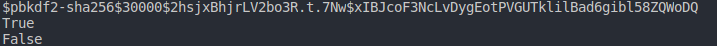

# Password Encryption - With Validation

Password hashing using the passlib library, to gain an understanding of how hashing works. 

## Getting Started

These instructions will get you a copy of the project up and running on your local machine for development and testing purposes.

## Installing

First install passlib

for Python 3:
> pip3 install passlib

otherwise:
> pip install passlib

## Running Tests

1. Call the function
   > encrypt_password()
2. Enter password for encryption
   > encrypt_password('abc')
3. Output will be presented such as:
   > $pbkdf2-sha256$30000$hLBWinFOydk7B8B4rzVGSA$LGw50SfZ0x/dLQLMZ0Wm5.DV07qwf91VTaN5/34VK4w

## For Validation

1. Call the function 
   >check_encrypted_password()
2. Pass in the arguments needed, being the password and the hash
   >check_encrypted_password('abc', '$pbkdf2-sha256$30000$hLBWinFOydk7B8B4rzVGSA$LGw50SfZ0x/dLQLMZ0Wm5.DV07qwf91VTaN5/34VK4w')
3. If correct password and hash, the output will show True.
   
## Screenshot

